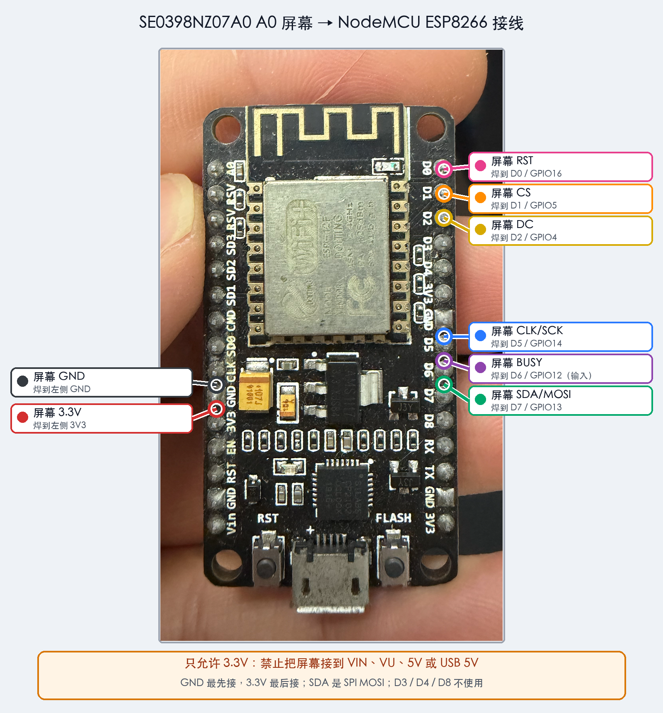

# 华为 3.98 寸 A0 四色墨水屏 NodeMCU 测试

本工程用于以 NodeMCU ESP8266 驱动 `SE0398NZ07A0`，并保留手机壳原 PCB、FPC 和原高压驱动电路。程序不联网、不保存整幅图片，只使用 192 字节行缓冲。

> 重要：必须先拆除或完全隔离原 PCB 上资料图片红圈内的原控制芯片。原控制器与 NodeMCU 不能同时连接 SPI/控制线。焊接和插拔 FPC 时必须断电。

## 文件

- `SE0398NZ07A0_NodeMCU_Test/SE0398NZ07A0_NodeMCU_Test.ino`：Arduino 测试程序，自动显示真实四色照片。
- `SE0398NZ07A0_NodeMCU_Test/sunset_image.h`：达马万德山图片的 768×552、2-bit 四色数据。
- `SE0398NZ07A0_NodeMCU_Test/marilyn_image.h`：梦露图片的 768×552、2-bit 四色数据。
- `SE0398NZ07A0_Shenzhen_Weather/SE0398NZ07A0_Shenzhen_Weather.ino`：深圳三日天气看板，直接访问 Open-Meteo。
- `SE0398NZ07A0_Shenzhen_Weather/secrets.example.h`：Wi-Fi 配置模板；本地复制为 `secrets.h`，不要提交真实密码。
- `tools/generate_epd_image.swift`：图片裁剪、四色量化和 2-bit 打包工具。

## 适用开发板

这里按最常见的 **NodeMCU 1.0（ESP-12E/ESP-12F，ESP8266）** 编写。Arduino IDE 中选择：

```text
开发板：NodeMCU 1.0 (ESP-12E Module)
CPU Frequency：80 MHz
Upload Speed：115200
```

如果你的板上主芯片不是 `ESP8266EX`，先不要接屏幕。

## 接线

下表中的屏幕信号名，对应原 PCB 接线图片里红线所指的测试焊盘。`SDA` 在这里是 SPI `MOSI`，不是 I2C。



| 原 PCB | NodeMCU 丝印 | ESP8266 GPIO | 方向 |
|---|---:|---:|---|
| `GND` | `G` / `GND` | GND | 共地 |
| `3.3V` | `3V3` | 3.3V | 给原 PCB 供电 |
| `SDA/MOSI` | `D7` | GPIO13 | NodeMCU → 屏幕 |
| `CLK/SCK` | `D5` | GPIO14 | NodeMCU → 屏幕 |
| `CS` | `D1` | GPIO5 | NodeMCU → 屏幕 |
| `DC` | `D2` | GPIO4 | NodeMCU → 屏幕 |
| `RST` | `D0` | GPIO16 | NodeMCU → 屏幕 |
| `BUSY` | `D6` | GPIO12 | 屏幕 → NodeMCU |

建议颜色：红线接 3.3V、黑线接 GND，其余每根使用不同颜色并在两端贴标签。`SCK/MOSI/CS/DC/RST` 各串联一个 `100–330Ω` 电阻，推荐 `220Ω` 并尽量靠近 NodeMCU；飞线尽量短于 10cm，SCK 最短。建议在 `CS`、`RST` 与 3.3V 之间各加 `10kΩ` 上拉，防止 NodeMCU 启动时屏幕被误选中或复位。BUSY 可选串联 `1kΩ` 作为输入保护。

没有使用 `D3/GPIO0`、`D4/GPIO2`、`D8/GPIO15`，因为它们会影响 ESP8266 启动模式。`D6` 虽然也是硬件 SPI 的 MISO，但本工程不读取 SPI，可以安全地将它作为 BUSY 输入。

### 3.3V 焊点必须先确认

现有低清接线图片能看清 GND 和六根信号线，但黄色 `3.3V` 字样没有明确指向一个唯一焊盘。不要因为文字靠近 FPC 就直接往 FPC 触点上焊。

在接 3.3V 前：

1. 用通断档确认 GND 焊盘与 PCB 大面积地铜相通。
2. 若原手机壳仍能正常供电，在未改装状态测量候选电源点相对 GND，应稳定在约 3.3V。
3. 完全断电后拆除原控制芯片，并检查附近没有焊锡桥或脱落元件。
4. 再次确认 3.3V 与 GND 没有短路，最后才接电源线。

请提供拆壳后 PCB 正反面的垂直高清照片后，再最终确认具体 3.3V 焊盘。

## 供电

首次测试可以先通过 USB 给 NodeMCU 供电，并由 NodeMCU 的 `3V3` 引脚给原 PCB 供电。测试程序会关闭 Wi-Fi，降低供电负担。不同 NodeMCU 克隆板的稳压器能力差异很大：如果串口出现重启、乱码或刷新时电压明显下降，应立即断电，改用稳定的独立 3.3V、至少 500mA（建议留出 1A 余量）电源给屏幕板供电，并与 NodeMCU 共地。

- 原 PCB 禁止连接 `VIN`、`VU`、`5V` 或 USB 5V。
- 使用独立 3.3V 时，不要把两个不同的 3.3V 电源输出直接并联。
- 可在原 PCB 电源焊点附近并联 `100–470uF` 电解电容和 `0.1uF` 陶瓷电容。
- 原 PCB 刷新期间会产生正负高压，不要触碰或测量未知的高压测试点。

## 烧录和测试

1. 先只用 USB 连接 NodeMCU，不接屏幕，烧录 `.ino`。
2. 断开 USB，按照接线表焊接；GND 最先接，3.3V 最后接。
3. 检查所有相邻焊盘无短路，再连接 USB。
4. 程序上电等待 3 秒后显示达马万德山图片；按 NodeMCU 板上的 `FLASH` 按键切换到梦露图片，再按一次切回。不按键时画面保持不变。
5. 串口监视器是可选的；使用时设置为 `115200 baud`，可以查看 BUSY、写入进度和错误原因。
6. 刷新时 BUSY 会变为 LOW，四色全刷可能持续数十秒。不要在刷新期间断电。
7. 每次切换图片都会关闭墨水屏高压并完整刷新；刷新完成后保持当前画面，不会自动切换。

`FLASH` 按键对应 `D3/GPIO0`，按键为低电平有效。不要在复位或烧录时按住该键，否则 ESP8266 会进入下载模式。

预期画面一：从 Wikimedia Commons 获取并量化的伊朗达马万德山日落照片。原图作者 Mahdi Kalhor，采用 CC BY 3.0：

```text
       RED sunset clouds
     YELLOW mountain light
       BLACK Damavand ridge
          WHITE sky/water
```


原图页面：<https://commons.wikimedia.org/wiki/File:%D8%A2%D8%AA%D8%B4%D9%81%D8%B4%D8%A7%D9%86_%D8%AF%D9%85%D8%A7%D9%88%D9%86%D8%AF_%D8%AF%D8%B1_%D8%A2%D8%AA%D8%B4_%D8%BA%D8%B1%D9%88%D8%A8%D8%8C_%D8%AA%D9%82%D8%AF%DB%8C%D9%85_%D8%A8%D9%87_%D8%A7%DB%8C%D8%B1%D8%A7%D9%86%DB%8C%D8%A7%D9%86_Damavand_or_Diamond,_to_dear_Iranian,_Polur,_Mazandaran,_Iran_-_panoramio.jpg>

预期画面二：Wikimedia Commons 上的《Marilyn Monroe I》绘画，作者 Silvia Klippert（照片 John Klippert），采用 CC BY-SA 3.0。它不是直接复制 Andy Warhol 原版丝网印刷，而是将可合法再利用的梦露绘画转换为黑、白、黄、红四色波普风格：


原图页面：<https://commons.wikimedia.org/wiki/File:Marilyn_Monroe_I.jpg>

原图下载地址和许可信息以页面为准。两张图各自每像素 2 bit，合计约 207 KiB；编译后的固件仍在 NodeMCU 1MB Flash 范围内。

如果图案整体精确旋转了 180 度，把程序中的：

```cpp
constexpr bool kRotateImage180 = false;
```

改成 `true` 后重新烧录。不要同时修改 A0 的物理行交错算法。

## 常见故障

| 现象 | 首先检查 |
|---|---|
| `BUSY timeout during hardware reset` | 3.3V、GND、BUSY、RST，以及原控制芯片是否真正隔离 |
| 刷新时 NodeMCU 重启 | 3.3V 电源压降、USB 线、屏幕电源去耦 |
| BUSY 正常但屏幕完全不变 | CS、DC、SDA/MOSI、CLK，或原控制器仍在占用信号线 |
| 出现隔行、撕裂或上下半屏错位 | 确认面板确为 `SE0398NZ07A0`，不要使用 A1 驱动 |
| 图案正好上下颠倒且左右也反向 | 打开 `kRotateImage180` |

程序使用 1MHz SPI、逐字节 CS、刷新阶段 180 秒 BUSY 超时和 A0 特有的行映射：前 276 个逻辑行写入物理偶数行，后 276 个逻辑行反向写入物理奇数行。

### 深圳天气固件

天气 sketch 使用深圳坐标（22.5431, 114.0579）访问 Open-Meteo，显示当前天气和未来三天预报。ESP8266 只支持 2.4GHz Wi-Fi。烧录前在该 sketch 目录复制 `secrets.example.h` 为 `secrets.h` 并填写本地 Wi-Fi；`secrets.h` 已被 Git 忽略，不会进入公开仓库。上电或按 FLASH 会联网更新，默认每小时自动更新一次。
