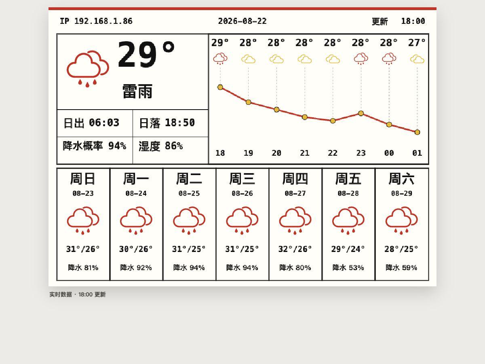

# SE0398NZ07A0 3.98 英寸四色墨水屏 ESP8266 项目

本项目使用 NodeMCU ESP8266 驱动华为手机壳中的 `SE0398NZ07A0` 768x552 A0 四色墨水屏，并复用原 PCB、FPC 和高压驱动电路。仓库包含两套 Arduino 固件：

- 深圳天气 + 比亚迪行情双页面看板；
- 两张四色照片切换的离线硬件测试程序。

两套固件都使用 192 字节行缓冲逐行输出，不在 ESP8266 RAM 中保存完整帧缓冲。天气固件通过 2.4 GHz Wi-Fi 获取实时数据，图片测试固件会关闭 Wi-Fi。

> 重要：必须先拆除或完全隔离原 PCB 上的原控制芯片。原控制器与 ESP8266 不能同时连接 SPI 和控制线。焊接、测量和插拔 FPC 时必须断电。

## 当前功能

### 深圳天气页

天气页使用深圳实际坐标 `22.5431, 114.0579`，访问免费、免 Key 的 [Open-Meteo](https://open-meteo.com/)：

- 顶部显示设备 IP、日期和更新时间；
- 显示当前天气图标、放大的当前温度和天气状况；
- 2x2 网格显示日出、日落、当天降水概率和湿度；
- 折线显示从当前小时开始的 8 个连续小时温度；
- 每个小时包含温度、天气图标和两位小时数；
- 底部显示从明天开始的未来 7 天预报，包括星期、日期、天气图标、高低温和降水概率。



上图为完整网页预览框架；屏幕区域与设备共享 768x552 坐标，实时天气接口不可用时会显示示例数据。

天气图标源自 iconfont.cn 的同系列图标，构建前已离线栅格化，因此 ESP8266 不需要下载图片资源。

### 比亚迪行情页

行情页通过腾讯免 Key 行情接口获取比亚迪 `sz002594` 数据，显示现价、涨跌额、涨跌幅、昨收、开盘、最高、最低、成交量和更新时间。

### 按键操作

驱动板板载 `FLASH` 按键连接 `D3/GPIO0`，低电平有效：

- 短按：重新获取并刷新当前页面；
- 长按约 1.2 秒：在天气页和比亚迪行情页之间切换；
- 图片测试固件中，按一次切换一张图片。

烧录或复位时不要按住 `FLASH`，否则 ESP8266 会进入下载模式。

## 仓库结构

| 路径 | 用途 |
|---|---|
| `SE0398NZ07A0_Shenzhen_Weather/` | 天气 + 比亚迪行情双页面固件 |
| `SE0398NZ07A0_Shenzhen_Weather/weather_font.h` | 中文 16x16 位图字体 |
| `SE0398NZ07A0_Shenzhen_Weather/weather_icons.h` | 96x96 天气图标位图掩码 |
| `SE0398NZ07A0_Shenzhen_Weather/secrets.example.h` | Wi-Fi 配置模板 |
| `SE0398NZ07A0_NodeMCU_Test/` | 两张四色照片切换的离线硬件测试固件 |
| `weather-preview/` | 与设备共享 768x552 坐标的实时网页预览 |
| `tools/generate_epd_image.swift` | 图片裁剪、四色量化和 2-bit 打包工具 |
| `tools/generate_cjk_font.swift` | 中文位图字体生成器 |
| `tools/generate_weather_icons.swift` | Iconfont SVG 路径栅格化工具 |
| `tools/test_*.py` | 布局、字体、图标、配色和预览回归测试 |

## 硬件

### 开发板

固件目标为 **NodeMCU 1.0 (ESP-12E/ESP-12F Module)**，主芯片必须是 `ESP8266EX`：

```text
Board: NodeMCU 1.0 (ESP-12E Module)
FQBN: esp8266:esp8266:nodemcuv2
CPU Frequency: 80 MHz
Upload Speed: 115200
```

### 接线

`SDA` 在本项目中是 SPI `MOSI`，不是 I2C 数据线。


| 替换 PCB | NodeMCU | ESP8266 GPIO | 方向 |
|---|---:|---:|---|
| `GND` | `GND` | GND | 共地 |
| `3.3V` | `3V3` | 3.3V | 给屏幕板供电 |
| `SDA/MOSI` | `D7` | GPIO13 | ESP8266 -> 屏幕 |
| `CLK/SCK` | `D5` | GPIO14 | ESP8266 -> 屏幕 |
| `CS` | `D8` | GPIO15 | ESP8266 -> 屏幕 |
| `DC` | `D2` | GPIO4 | ESP8266 -> 屏幕 |
| `RST` | `D1` | GPIO5 | ESP8266 -> 屏幕 |
| `BUSY` | `D0` | GPIO16 | 屏幕 -> ESP8266 |
| `FLASH` | `D3` | GPIO0 | 板载按键输入 |

项目采用 `EspInfo` 中 Waveshare e-Paper ESP8266 Driver Board 的旧版映射。硬件 SPI 使用 `D5/GPIO14=SCK` 和 `D7/GPIO13=MOSI`。

建议让 `SCK/MOSI/CS/DC/RST` 各串联 `100-330 ohm` 电阻，推荐 `220 ohm`，并让 SCK 飞线最短。`RST` 可增加 `10k ohm` 上拉；不要把 `CS=D8/GPIO15` 上拉到 3.3V，因为该引脚参与 ESP8266 启动模式选择。BUSY 可串联 `1k ohm` 作为输入保护。

### 供电与高压安全

- 原 PCB 禁止连接 `VIN`、`VU`、`5V` 或 USB 5V；
- 首次测试可由 NodeMCU `3V3` 供电，出现重启或压降时应改用稳定的独立 3.3V 电源；
- 独立电源建议至少 500mA，并预留 1A 余量，与 NodeMCU 共地；
- 不要直接并联两个不同的 3.3V 电源；
- 可在屏幕板电源附近增加 `100-470uF` 电解电容和 `0.1uF` 陶瓷电容；
- 墨水屏刷新期间会产生正负高压，不要触碰或测量未知高压测试点。

现有接线图片无法唯一确认原 PCB 的 3.3V 焊点。接电前必须用通断档和电压测量确认 GND、3.3V 与相邻焊盘之间没有短路。

## 配置天气固件

复制 Wi-Fi 配置模板：

```bash
cp SE0398NZ07A0_Shenzhen_Weather/secrets.example.h \
  SE0398NZ07A0_Shenzhen_Weather/secrets.h
```

编辑本地 `secrets.h` 中的 2.4 GHz Wi-Fi 名称和密码。该文件已被 Git 忽略，不应提交真实凭据。

## 编译与烧录

需要安装 Arduino CLI、ESP8266 Arduino Core `3.1.2` 和 ArduinoJson。

编译天气固件：

```bash
arduino-cli compile \
  --fqbn esp8266:esp8266:nodemcuv2 \
  --output-dir /tmp/nova398-weather-build \
  SE0398NZ07A0_Shenzhen_Weather
```

列出串口并确认实际 ESP8266 端口：

```bash
arduino-cli board list
```

烧录天气固件，将 `<PORT>` 替换为已确认的 ESP8266 串口：

```bash
arduino-cli upload \
  --fqbn esp8266:esp8266:nodemcuv2 \
  --input-dir /tmp/nova398-weather-build \
  -p <PORT> \
  SE0398NZ07A0_Shenzhen_Weather
```

串口日志使用 `115200 baud`。正常启动会看到 Wi-Fi 连接、天气字段、`hourly 8`、逐行写入进度和 `Display complete.`。四色全刷可能持续数十秒，刷新期间不要断电。

## 网页预览

网页预览使用与设备相同的 768x552 内部坐标，并访问相同的 Open-Meteo 字段。接口失败时会显示明确标记的示例数据。

在仓库根目录启动静态服务器：

```bash
python3 -m http.server 8000
```

然后打开：

```text
http://127.0.0.1:8000/weather-preview/
```

## 测试

修改天气数据、固定坐标、字体或图标后，运行：

```bash
python3 tools/test_weather_dashboard.py
python3 tools/test_weather_preview.py
python3 tools/test_weather_palette.py
python3 tools/test_text_raster.py
python3 tools/test_weather_icons.py
```

测试覆盖 Open-Meteo 字段、8 小时与 7 天索引对齐、2x2 指标网格、温度度数符号、A0 配色、中文方向、Iconfont 掩码和网页预览契约。

## 实现说明

- 面板使用黑、白、黄、红四种 A0 颜色编码；
- SPI 频率为 1 MHz，并使用逐字节 CS；
- 每行包含 768 个 2-bit 像素，因此行缓冲为 192 字节；
- A0 行映射将前 276 个逻辑行写入物理偶数行，后 276 个逻辑行反向写入物理奇数行；
- 刷新阶段 BUSY 超时为 180 秒；
- 中文字体生成时已修正 CoreGraphics 内存行方向，不能再对单字或整屏做左右镜像。

## 常见故障

| 现象 | 首先检查 |
|---|---|
| `BUSY timeout during hardware reset` | 3.3V、GND、BUSY、RST，以及原控制芯片是否完全隔离 |
| Wi-Fi 连接失败 | 只使用 2.4 GHz 网络，检查本地 `secrets.h` |
| 天气接口解析失败 | 串口 HTTP 状态、系统时间、网络和 Open-Meteo 可用性 |
| 刷新时 NodeMCU 重启 | 3.3V 电源压降、USB 线和屏幕电源去耦 |
| BUSY 正常但屏幕不变 | CS、DC、MOSI、SCK，或原控制器仍占用总线 |
| 隔行、撕裂或上下半屏错位 | 确认面板为 `SE0398NZ07A0 A0`，不要使用 A1 行映射 |
| 图片整体旋转 180 度 | 仅在图片测试固件中启用 `kRotateImage180` |

## 图片来源与授权

图片测试固件包含两张离线量化图片：

- 伊朗达马万德山日落照片，作者 Mahdi Kalhor，采用 CC BY 3.0：[原图页面](https://commons.wikimedia.org/wiki/File:%D8%A2%D8%AA%D8%B4%D9%81%D8%B4%D8%A7%D9%86_%D8%AF%D9%85%D8%A7%D9%88%D9%86%D8%AF_%D8%AF%D8%B1_%D8%A2%D8%AA%D8%B4_%D8%BA%D8%B1%D9%88%D8%A8%D8%8C_%D8%AA%D9%82%D8%AF%DB%8C%D9%85_%D8%A8%D9%87_%D8%A7%DB%8C%D8%B1%D8%A7%D9%86%DB%8C%D8%A7%D9%86_Damavand_or_Diamond,_to_dear_Iranian,_Polur,_Mazandaran,_Iran_-_panoramio.jpg)
- 《Marilyn Monroe I》绘画，作者 Silvia Klippert，照片 John Klippert，采用 CC BY-SA 3.0：[原图页面](https://commons.wikimedia.org/wiki/File:Marilyn_Monroe_I.jpg)

图片授权和下载地址以 Wikimedia Commons 原页面为准。
